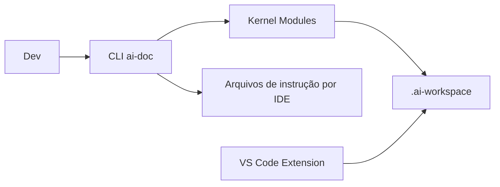

> 🍞 **Caminho**: [Home](../README.md) > Contexto Geral

# 🌍 Contexto do Projeto

**AI Agent IDE Context Sync** é um hub universal de contexto e memória para agentes de IA em múltiplas IDEs. Ele centraliza regras, memória e tarefas em um kernel modular, sincronizando instruções para Cursor, Windsurf, Trae, Claude, Copilot, Gemini e outros.

> 📅 **Última Atualização**: 2026-01-22 | 👤 **Responsável**: Junio de Almeida Vitorino

---

## 🎯 Objetivos

1.  Reduzir retrabalho de manter contexto em múltiplas IDEs.
2.  Centralizar memória, tasks e análises do projeto em um workspace versionável.
3.  Evoluir automaticamente heurísticas para melhorar prompts e navegação.

## 🧭 Escopo

### ✅ Inclui
- CLI `ai-doc` para inicializar, compilar e sincronizar contexto.
- Kernel modular com Identity, Memory, Tasks, Analysis e integrações por stack.
- Extensão VS Code para gestão visual de personas, tasks e métricas.
- `.ai-workspace/` local para estado, cache e análises do projeto.

### ❌ Não inclui
- Execução de modelos de IA ou inferência em cloud.
- Armazenamento remoto de dados sensíveis do projeto.

## 👥 Público-alvo e Stakeholders

| Grupo | Necessidade | Valor |
| :--- | :--- | :--- |
| Desenvolvedores | Contexto consistente entre IDEs | Menos retrabalho e mais precisão da IA |
| Líderes técnicos | Governança de padrões e tarefas | Padronização e rastreabilidade |
| Mantenedores | Evolução do kernel e extensão | Base sólida para escalar o projeto |

## 🧩 Domínios e Subdomínios

| Domínio | Subdomínios | Status |
| :--- | :--- | :--- |
| Context Sync | Build, outputs por IDE | Ativo |
| Kernel Modular | Core, Identity, Memory, Tasks, Analysis | Ativo |
| Heuristics | Navegação, otimizações de prompt | Ativo |
| Soul System | Export/Import de conhecimento | Ativo |
| VS Code Extension | UI, dashboards, Kanban, Pomodoro | Ativo |

## 🧱 Arquitetura em Alto Nível

### Componentes Principais
- CLI `ai-doc` (Node.js)
- Kernel modular em `packages/cli/modules/`
- Workspace local `.ai-workspace/`
- Extensão VS Code em `packages/extension/`

### Fluxos Principais

### Dependências Críticas
- Node.js + npm (runtime e distribuição)
- VS Code API (extensão)
- Open VSX/NPM (distribuição)
- Git (versionamento do contexto)

## 🗂️ Mapa da Documentação

- **[Introdução](./00--intro/README.md)**: visão geral e onboarding.
- **[Manual do Usuário](./30--user-manual/README.md)**: uso da CLI e extensão.
- **[Manual Técnico](./40--tech-manual/README.md)**: arquitetura e padrões.
- **[Stack](./55--tech-stack/README.md)**: tecnologias e versões.

## 📦 Produtos e Módulos

| Módulo | Descrição | Dono |
| :--- | :--- | :--- |
| CLI (ai-doc) | Geração e sincronização de contexto | Maintainers |
| VS Code Extension | UI para personas, tasks e métricas | Maintainers |
| Kernel Modules | Regras, heurísticas, integrações | Maintainers |
| Soul System | Base de conhecimento portável | Maintainers |

## 🔐 Segurança e Compliance

- **Dados sensíveis**: Contexto local do projeto; evitar segredos no workspace.
- **Políticas**: MIT License, responsabilidade do usuário sobre conteúdo.
- **Controles**: Versionamento em Git, revisão manual e isolamento local.

## 📈 Observabilidade e Métricas

- **SLI/SLO**: Não definido formalmente.
- **Logs**: CLI em console; extensão via UI.
- **Alertas**: Não aplicável no momento.

## 🧪 Qualidade e Testes

- **CLI**: `npx jest` (packages/cli).
- **Extensão**: `eslint` + testes VS Code (`node ./test/runTest.js`).
- **Cobertura mínima**: Não definida no repositório.

## 🚀 Deploy e Operação

- **Ambientes**: Local do dev + distribuição NPM/Open VSX.
- **Ciclos**: Publicação via `npm publish`, `vsce package/publish`.
- **Rollback**: Reversão de versão no NPM/Open VSX.

## 🧠 Decisões-chave

| ID | Decisão | Status |
| :--- | :--- | :--- |
| ADR-001 | Monorepo com `packages/cli` e `packages/extension` | Aceita |
| ADR-002 | Kernel modular compilado para múltiplas IDEs | Aceita |

## 🧾 Glossário

- **Kernel**: Conjunto de módulos e regras que definem comportamento do agente.
- **Workspace**: Pasta `.ai-workspace/` com estado local do projeto.
- **Soul**: Base de conhecimento portável exportável/importável.
- **Heurísticas**: Padrões aprendidos automaticamente pelo sistema.

## ✅ Checklist de Atualização

- ✅ Links cruzados atualizados
- ✅ Breadcrumbs revisados
- ✅ Arquitetura alinhada com o código

## 📜 Histórico de Alterações

| Data | Versão | Autor | Descrição |
| :--- | :---: | :--- | :--- |
| 2026-01-22 | 1.0.0 | Junio de Almeida Vitorino | Criação inicial preenchida a partir do repositório. |

## 🔗 Links Relacionados

> 🔗 **Veja também**:
> *   **[Manual Técnico](./40--tech-manual/README.md)**: detalhes de arquitetura.
> *   **[Manual do Usuário](./30--user-manual/README.md)**: uso do sistema.
> *   **[README do Projeto](../README.md)**: visão geral pública.
