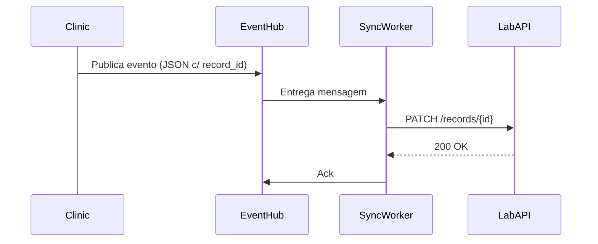

> [router] Template selecionado: Blueprint Proposal
{{> _partial-header.md }}

## 🧭 Visão Geral
- 🌱 **Problema/Oportunidade:** Reduzir tempo de sincronização de prontuários entre clínica e laboratório (atual >15min).
- 🎯 **Objetivo:** Implementar barramento de eventos com confirmação em menos de 2min.
- 🧱 **Escopo:** Serviços `prontuario`, `labs-gateway`, fila RabbitMQ dedicada e dashboard de monitoria.

---

## 🏗️ Arquitetura Proposta
### 🔹 Componentes
- **Event Hub:** tópico `medical.records.updated` em RabbitMQ redundante.
- **Sync Worker:** consumidor Laravel Octane escutando eventos e persistindo em `labs_sync_jobs`.
- **Audit Dashboard:** painel em docs/30--user-manual/33--flows/sync-monitor.md (novo) com métricas via Horizon.

### 🔹 Fluxo

---

## ⚖️ Avaliação
| Opção | Prós | Contras |
| :--- | :--- | :--- |
| Assíncrono (proposta) | Desacopla sistemas, monitora fila | Introduz infraestrutura RabbitMQ + custo manutenção |
| Síncrono atual (REST) | Sem fila extra | Latência alta, bloqueio em lote |

---

## 🚀 Plano de Execução
1. Criar fila dedicada `lab_sync_high` e aplicar IaC (Terraform) — 👤 DevOps.
2. Implementar consumidor Laravel com testes de integração @app/Console/Commands/SyncLabRecords.php#1-120 — 👤 Backend.
3. Criar painel Horizon + documentação para suporte 📝 — 👤 Tech Writer.

⏱️ **Timing sugerido:** 1 sprint (setup infra) + 1 sprint (dev/test rollout).

---

## 🗺️ Controle de Progresso
- ✅ Definir arquitetura proposta.
- ✅ Validar componentes e fluxo.
- ☐ Provisionar fila `lab_sync_high`.
- ☐ Implementar consumidor + testes.
- ☐ Criar painel Horizon + documentação.

> **Widget – Próximo Passo Imediato**  
> Rodar POC local executando `php artisan queue:work --queue=lab_sync_high --once` para medir throughput inicial.

{{> _partial-footer.md }}
