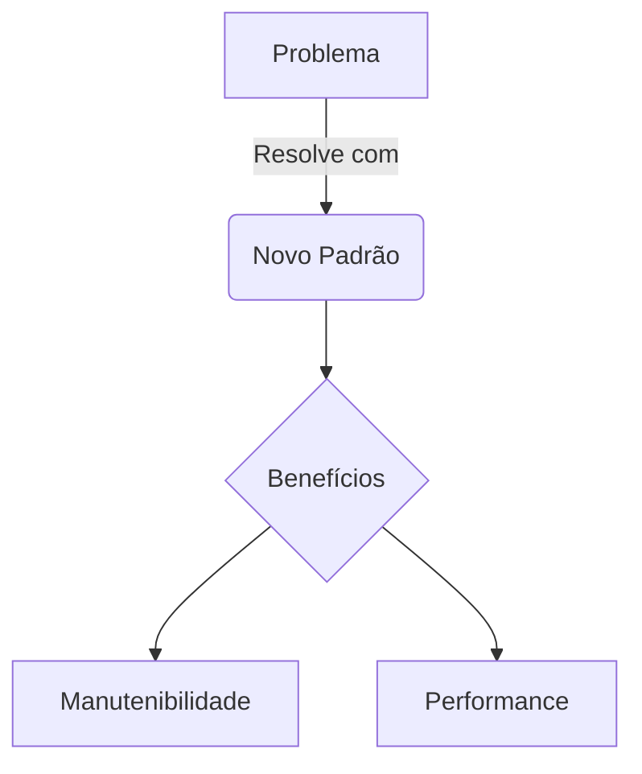

> 🍞 **Caminho**: [Home](../../README.md) > [Padrões Técnicos](../README.md) > [Nome do Padrão]

# 🏗️ [Nome do Padrão Técnico]

**[Resumo executivo do padrão e seu objetivo principal]**

> 📅 **Última Atualização**: YYYY-MM-DD | 👤 **Autor**: [Nome]
>
>  <!-- Use: Proposto, Em Uso, Deprecado -->
>  <!-- Use: Backend, Frontend, DevOps, DB -->

<!-- 🤖 AI NOTICE: Mantenha o tom amigável e educativo (ver docs/00--intro/ai-agent-tone.md) -->

---

> 🔗 **Relacionados**: [Padrão Anterior](./old-pattern.md) • [RFC Original](../rfcs/001.md)
> 📑 **Índice**: [Problema](#-contexto--problema) • [Solução](#-solução-proposta) • [Implementação](#-implementação)

## 🎯 Contexto & Problema

[Descreva o cenário atual. Por que o jeito antigo não funciona mais? Qual a dor?]

> [!NOTE]
> **Contexto**: Explicar limitações de performance, legibilidade ou escalabilidade.

## 💡 Solução Proposta

[Explicação detalhada da nova abordagem.]

### Diagrama Conceitual



### Princípios Chave
1.  **[Princípio 1]**: [Descrição]
2.  **[Princípio 2]**: [Descrição]

## 🛠️ Implementação

### Estrutura de Arquivos

```text
src/
├── Domain/
│   └── Pattern/
│       ├── BaseClass.ts
│       └── Interface.ts
```

### Exemplo de Código

**`path/to/example.ts`**

```typescript
// Exemplo prático de como aplicar o padrão
export class Example implements Pattern {
    execute() {
        // ...
    }
}
```

## ⚠️ Anti-Patterns (O que NÃO fazer)

> [!CAUTION]
> **Evite**: Não utilize este padrão para casos simples onde X resolveria.

*   ❌ **Erro Comum 1**: [Descrição]
*   ❌ **Erro Comum 2**: [Descrição]

## 📚 Referências & Leitura Adicional

*   [Link para Documentação Oficial](https://...)
*   [Artigo ou Livro de Referência](https://...)

## 📜 Histórico de Alterações

| Data | Versão | Autor | Descrição |
| :--- | :---: | :--- | :--- |
| YYYY-MM-DD | 1.0.0 | [Nome] | Criação inicial. |

## 🔗 Veja Também

> 🔗 **Links Relacionados**:
> *   **[Padrões Backend](../20--project-architecture-patterns/backend-patterns/README.md)**: Contexto backend.
> *   **[Padrões Frontend](../20--project-architecture-patterns/frontend-patterns/README.md)**: Contexto frontend.
