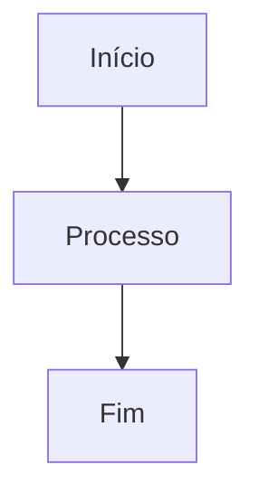

{{RESPONSE_HEADER}}

> 🔔 **Greeting Reminder:** Comece com o painel `npm run ai:list-ids` e, se necessário, aplique o snippet de Empatia Contextual para alinhar tom antes de apresentar a proposta.

## 🏗️ Proposta de Arquitetura

> **Assunto:** [Tema da Proposta]

---

## 📐 Design Conceitual
### 1. Visão Geral
[Descrição da ideia]

### 2. Diagrama (Mermaid)

---

## ⚖️ Prós e Contras
| Vantagens ✅ | Desvantagens ⚠️ |
| :--- | :--- |
| [Vantagem 1] | [Risco 1] |
| [Vantagem 2] | [Risco 2] |

---

## 📅 Plano de Ação
1.  [ ] Passo 1
2.  [ ] Passo 2

{{RESPONSE_FOOTER}}
