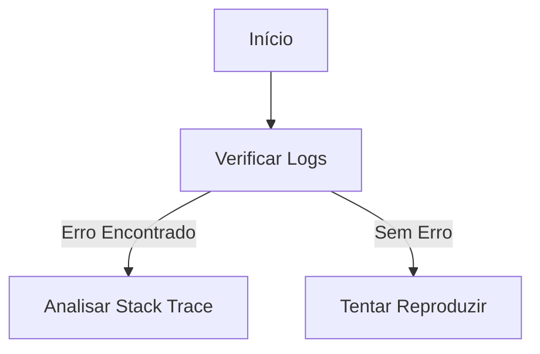

> 🍞 **Caminho**: [Home](../../README.md) > [Análises](../README.md) > [Título da Análise]

# 🔍 Análise: [Título da Análise/RFC]

**[Resumo do problema ou proposta em investigação]**

> 📅 **Data**: YYYY-MM-DD | 👤 **Autor**: [Nome]
>
>  <!-- Em Aberto, Concluído, Pausado -->

---

> 📑 **Índice**: [Investigação](#-processo-de-investigação) • [Conclusão](#-conclusões--solução-recomendada)

## 🧐 Problema / Cenário

[Descreva detalhadamente o problema, bug intermitente ou necessidade de mudança arquitetural.]

> [!IMPORTANT]
> **Impacto**: Descreva qual o impacto atual (ex: lentidão, erros para 5% dos usuários).

## 🧪 Hipóteses

| ID | Hipótese | Probabilidade | Status |
| :--- | :--- | :--- | :--- |
| H1 | O problema é no banco de dados (lock) | Alta | ⏳ Em validação |
| H2 | O problema é na rede (timeout) | Baixa | ❌ Descartada |

## 🧭 Escopo da Investigação

- **Inclui**: [Áreas cobertas]
- **Não inclui**: [Fora do escopo]

## 🔍 Processo de Investigação

### Mapa de Investigação



### Evidências Coletadas

<details>
<summary>👀 Clique para ver os Logs de Erro</summary>

```json
{
  "level": "error",
  "message": "Connection timeout",
  "context": { ... }
}
```
</details>

<details>
<summary>👀 Clique para ver a Query SQL suspeita</summary>

```sql
SELECT * FROM huge_table WHERE non_indexed_col = 'X';
```
</details>

## 💡 Conclusões & Solução Recomendada

**Veredito**: [A Hipótese H1 foi confirmada.]

**Recomendação Técnica**:
1.  Criar índice na coluna X.
2.  Refatorar query para usar paginação.

## 🧩 Alternativas Consideradas

| Alternativa | Prós | Contras |
| :--- | :--- | :--- |
| [Alternativa A] | [Prós] | [Contras] |

## 📈 Métricas de Validação

- **Antes**: [Métrica base]
- **Depois**: [Meta]

## 🧪 Plano de Teste e Observabilidade

- **Testes**: [Tipos]
- **Monitoramento**: [Alertas]

## 📅 Plano de Ação (Próximos Passos)

- [ ] Criar Migration de índice (Task #123).
- [ ] Monitorar performance por 24h.
- [ ] Atualizar documentação de padrões de banco.

## 📜 Histórico de Alterações

| Data | Versão | Autor | Descrição |
| :--- | :---: | :--- | :--- |
| YYYY-MM-DD | 1.0.0 | [Nome] | Criação inicial. |

## 🔗 Veja Também

> 🔗 **Links Relacionados**:
> *   **[Tarefas](../../data/tasks/README.md)**: Acompanhe o progresso.
> *   **[Manual Técnico](../40--tech-manual/README.md)**: Padrões afetados.
