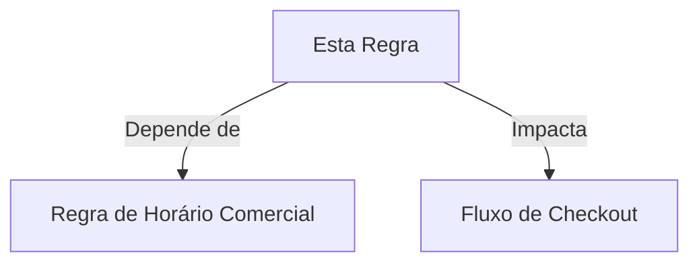

> 🍞 **Caminho**: [Home](../../README.md) > [Regras de Negócio](../README.md) > [ID Regra]

# ⚖️ Regra de Negócio: [Nome da Regra]

**[Definição clara e única da regra em uma frase]**

> 📅 **Última Atualização**: YYYY-MM-DD
>
> 
>  <!-- Ativa, Deprecada, Proposta -->
> 

---

> 🔗 **Relacionados**: [Entidade: Agendamento](../entities/appointments.md)
> 📑 **Índice**: [Definição](#-definição-detalhada) • [Cenários](#-cenários-de-teste-gherkin) • [Implementação](#-implementação-técnica)

## 📜 Definição Detalhada

[Explique a regra com detalhes. Ex: Um paciente não pode agendar duas consultas no mesmo horário, mesmo que com médicos diferentes.]

> [!IMPORTANT]
> **Motivação**: Evitar conflitos de agenda e duplicidade de faturamento.

## ✅ Critérios da Regra

- **Condição**: [Quando a regra se aplica]
- **Ação**: [O que deve acontecer]
- **Resultado**: [Saída esperada]

## 🧮 Fórmulas e Cálculos

| Campo | Fórmula | Observação |
| :--- | :--- | :--- |
| [Campo] | [Fórmula] | [Nota] |

## 📥 Entradas e Fontes de Dados

- **Dados obrigatórios**: [Lista]
- **Fonte**: [Sistema/Tabela/Serviço]

## 🧾 Invariantes e Garantias

- [Invariante 1]
- [Invariante 2]

## 🧪 Cenários de Teste (Gherkin)

Utilizamos a sintaxe Gherkin para descrever os cenários de aceitação.

### Cenário 1: Tentativa de agendamento duplicado (Falha)

```gherkin
Dado que o paciente "João" já possui um agendamento para 10/10 às 14:00
Quando o paciente tenta criar um novo agendamento para 10/10 às 14:00
Então o sistema deve bloquear a operação
E exibir a mensagem de erro "Conflito de horário detectado"
```

### Cenário 2: Agendamento em horário livre (Sucesso)

```gherkin
Dado que o paciente "João" NÃO possui agendamentos para 10/10 às 16:00
Quando o paciente tenta criar um novo agendamento para 10/10 às 16:00
Então o sistema deve confirmar o agendamento com sucesso
```

## 🚫 Exceções e Edge Cases

*   **Exceção A**: Administradores podem forçar o agendamento (Override).
*   **Exceção B**: Consultas de emergência não passam por esta validação.

## 💻 Implementação Técnica

### Onde a regra vive?

*   **Camada**: Backend (Service Layer)
*   **Classe**: `App\Services\AppointmentService.php`
*   **Método**: `checkAvailability(User $patient, Carbon $date)`

### Snippet de Validação

```php
public function checkAvailability($patient, $date) {
    $exists = Appointment::where('patient_id', $patient->id)
        ->where('start_time', $date)
        ->exists();

    if ($exists) {
        throw new BusinessRuleException('Conflito de horário.');
    }
}
```

## 🔗 Dependências



## 📜 Histórico de Alterações

| Data | Versão | Autor | Descrição |
| :--- | :---: | :--- | :--- |
| YYYY-MM-DD | 1.0.0 | [Nome] | Criação inicial. |

## 🔗 Veja Também

> 🔗 **Links Relacionados**:
> *   **[Entidades](../40--tech-manual/40--entities/README.md)**: Dados envolvidos.
> *   **[Fluxos](../30--user-manual/33--flows/README.md)**: Onde a regra é aplicada.
