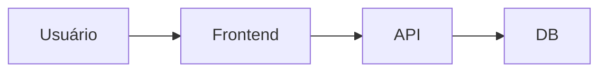

> 🍞 **Caminho**: [Home](../../README.md) > Contexto Geral

# 🌍 Contexto do Projeto

**[Resumo executivo do propósito do sistema em 2–3 linhas]**

> 📅 **Última Atualização**: YYYY-MM-DD | 👤 **Responsável**: [Nome/Time]

---

## 🎯 Objetivos

1.  [Objetivo de negócio 1]
2.  [Objetivo de negócio 2]
3.  [Objetivo técnico 3]

## 🧭 Escopo

### ✅ Inclui
- [Funcionalidade principal]
- [Domínio coberto]

### ❌ Não inclui
- [Exceção relevante]
- [Limite de escopo]

## 👥 Público-alvo e Stakeholders

| Grupo | Necessidade | Valor |
| :--- | :--- | :--- |
| [Usuários finais] | [Necessidade] | [Valor] |
| [Equipe interna] | [Necessidade] | [Valor] |

## 🧩 Domínios e Subdomínios

| Domínio | Subdomínios | Status |
| :--- | :--- | :--- |
| [Domínio A] | [Subdomínios] | [Ativo/WIP] |
| [Domínio B] | [Subdomínios] | [Ativo/WIP] |

## 🧱 Arquitetura em Alto Nível

### Componentes Principais
- [Frontend]
- [Backend]
- [Serviços Externos]

### Fluxos Principais

### Dependências Críticas
- [Serviço Externo 1]
- [Fila/Mensageria]

## 🗂️ Mapa da Documentação

- **[Introdução](./00--intro/README.md)**: visão geral.
- **[Manual do Usuário](./30--user-manual/README.md)**: uso do sistema.
- **[Manual Técnico](./40--tech-manual/README.md)**: arquitetura e padrões.
- **[Stack](./55--tech-stack/README.md)**: tecnologias e versões.

## 📦 Produtos e Módulos

| Módulo | Descrição | Dono |
| :--- | :--- | :--- |
| [Módulo X] | [Descrição] | [Time] |
| [Módulo Y] | [Descrição] | [Time] |

## 🔐 Segurança e Compliance

- **Dados sensíveis**: [PII/PHI/etc.]
- **Políticas**: [LGPD/GDPR/SOC2]
- **Controles**: [Criptografia, auditoria]

## 📈 Observabilidade e Métricas

- **SLI/SLO**: [Métrica principal]
- **Logs**: [Local e padrão]
- **Alertas**: [Condições]

## 🧪 Qualidade e Testes

- **Cobertura mínima**: [Percentual]
- **Tipos de teste**: [Unit, Integration, E2E]
- **Gatilhos de release**: [Regras]

## 🚀 Deploy e Operação

- **Ambientes**: [dev, staging, prod]
- **Ciclos**: [CI/CD, janelas]
- **Rollback**: [Estratégia]

## 🧠 Decisões-chave

| ID | Decisão | Status |
| :--- | :--- | :--- |
| ADR-001 | [Resumo] | [Aceita] |

## 🧾 Glossário

- **[Termo 1]**: [Definição]
- **[Termo 2]**: [Definição]

## ✅ Checklist de Atualização

- [ ] Links cruzados atualizados
- [ ] Breadcrumbs revisados
- [ ] Arquitetura alinhada com o código

## 📜 Histórico de Alterações

| Data | Versão | Autor | Descrição |
| :--- | :---: | :--- | :--- |
| YYYY-MM-DD | 1.0.0 | [Nome] | Criação inicial. |

## 🔗 Links Relacionados

> 🔗 **Veja também**:
> *   **[Manual Técnico](./40--tech-manual/README.md)**: detalhes de arquitetura.
> *   **[Manual do Usuário](./30--user-manual/README.md)**: uso do sistema.
