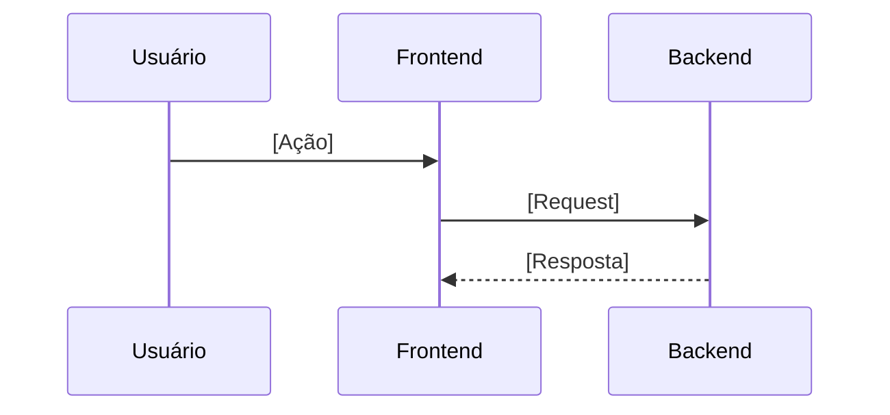

> 🍞 **Caminho**: [Home](../../README.md) > [Contexto Geral](../README.md) > [Subdomínio]

# 🧩 Contexto: [Subdomínio]

**[Resumo objetivo do subdomínio e por que ele existe]**

> 📅 **Última Atualização**: YYYY-MM-DD | 👤 **Responsável**: [Nome/Time]

---

## 🎯 Objetivo do Subdomínio

- [Objetivo principal]
- [Objetivo secundário]

## 🧭 Escopo Funcional

### ✅ Inclui
- [Funcionalidade]
- [Processo]

### ❌ Não inclui
- [Limite importante]
- [Exceção]

## 👥 Personas e Jornada

| Persona | Dor | Objetivo |
| :--- | :--- | :--- |
| [Persona A] | [Dor] | [Objetivo] |

## 🧱 Componentes e Responsabilidades

| Componente | Responsabilidade | Interface |
| :--- | :--- | :--- |
| [Serviço A] | [Responsabilidade] | [API/Evento] |

## 🔁 Fluxos Principais

### Fluxo 1

## 🗂️ Dados e Entidades

- **[Entidade X](../40--tech-manual/40--entities/README.md)**: [Papel]
- **[Entidade Y](../40--tech-manual/40--entities/README.md)**: [Papel]

## 🔌 Integrações e Dependências

- [Serviço externo]
- [Fila/Stream]

## 🔐 Segurança e Permissões

- **Autorização**: [Policies]
- **Privacidade**: [Dados sensíveis]

## 🧪 Testes e Qualidade

- **Testes críticos**: [Cenários]
- **Cobertura mínima**: [Percentual]

## 🚩 Riscos e Edge Cases

- [Risco 1]
- [Risco 2]

## ✅ Checklist de Atualização

- [ ] Fluxos sincronizados com o código
- [ ] Links cruzados atualizados
- [ ] Regras de negócio revisadas

## 📜 Histórico de Alterações

| Data | Versão | Autor | Descrição |
| :--- | :---: | :--- | :--- |
| YYYY-MM-DD | 1.0.0 | [Nome] | Criação inicial. |

## 🔗 Links Relacionados

> 🔗 **Veja também**:
> *   **[Contexto Geral](../README.md)**: visão macro.
> *   **[Manual Técnico](../40--tech-manual/README.md)**: padrões e arquitetura.
